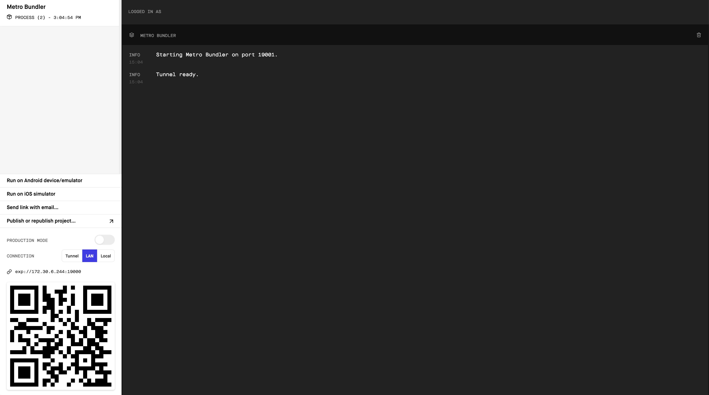

What's **Wthr**? It's a new native app that shows the current weather info on your phone.

_What does it mean to be a native app?_ As a native app, it runs truly native code on your device.

Does it work on iOS or Android? It runs on both! This project is built with **React Native**. React Native can build for Android and iOS both from the same code base. React Native is based on React which is a JavaScript library for creating user interfaces. React Native is written with JavaScript using the syntax and patterns used with React but compiles into native iOS or Android code.

Read more about it [here](https://facebook.github.io/react-native/).

# Why Is This Important

Learning this will provide the foundation for the work you'll do through FEW 2.4, where you'll be building more complex react native apps and doing a deeper dive on the fundamentals that you'll learn here.

# Prerequisites

You need to know the basics of JavaScript. If you have experience with React that will help but is not required.

You do need a computer with a text editor and mobile phone, iOS or Android for testing your project. You can also test from the desktop using the iOS or Android simulator, but this is more work than testing on a real phone. **For this purpose of this tutorial, we will test from a real device.**

# Learning Outcomes

By the end of this tutorial, students should be able to...

1. Use and create React Native Components
1. Use Props and State to configure and manage components
1. Use Native networking


# Technical Planning

Let's get a good outline going of what we need to do:

1. Build out the components of this app
1. Implement the lifecycle methods for the Components
1. Implement props and load in weather data

# Node.JS

To work with React Native you'll need to install Node.js:

> [action]
>
> Install Node via this [download link](https://nodejs.org/en/download/), or through a package manager of your choice such as [Homebrew](https://brew.sh/)

# Installing Xcode or Android Studio

If you're building apps for iOS you'll want to install Xcode. This only runs on a Mac. If you want to build apps for Android you'll want to install Android Studio. This runs on either Mac or Windows.

> [action]
>
> If you're building for iOS, [install Xcode here](https://itunes.apple.com/us/app/xcode/id497799835?mt=12) and be sure to install with Command Line Tools as well. If you didn't, you can still install them by following [these instructions](http://osxdaily.com/2014/02/12/install-command-line-tools-mac-os-x/)
>
> If you're building for Android,  [install Android Studio here](https://developer.android.com/studio/install)

# Set Up Git/GitHub

Much like we've done in earlier tutorials, make sure you're committing your code as you complete milestones. At a minimum, you should make a commit whenever the tutorial prompts you.

Now set up your repo!

>[action]
> Make your first commit
>
```bash
$ git init
$ git add .
$ git commit -m 'project init'
```

Now Go to GitHub and create a public repository called REPO-NAME, and now associate it as a remote for your local git project and then push to it.

>[action]
> Push it!
>
```bash
$ git remote add origin GITHUB-REPO-URL
$ git push origin master -u
```

# Init with Expo

Once those are done, let's get our project set up. We're going to be using [Expo](https://expo.io/learn) to display our product on our mobile devices.

> [action]
>
> Open the terminal and install Expo. After that, use Expo to initialize your project. Replace `<NameOfProject>` with the name of the project you are creating.
>
```bash
$ npm install expo-cli --g
$ expo init <NameOfProject>
```

Expo will prompt you with a few commands. Provide the following answers:

> [action]
>
> The command will prompt you for the type of starter project you want to create. **Choose 'Blank template'**
>
> Next, the command prompts you for an app name. This can be different from the project name.
>
> Wait for the process to finish installing all of the dependent files.

While those are installing, you'll need to install the Expo Client on your phone before being able to use your app. Expo Client runs in your phone and is used to preview your App while you work.

> [action]
>
> Install the Expo Client on your phone:
>
> - [iOS app](https://itunes.apple.com/app/apple-store/id982107779)
> - [Android](https://play.google.com/store/apps/details?id=host.exp.exponent&referrer=www)
>
> Sign up for an account in the app in order to use it.

After all the dependencies are installed, follow the prompts at the end:

> [action]
>
> Run the following commands, replacing `<NameOfProject>` with your project name:
>
```bash
$ cd <NameOfProject>
$ npm start
```

This should open a browser window which looks something like:



> [action]
>
> Scan the QR code in the lower left with your phone.
>
> On the iPhone you can open the camera and scan the image, you don't need to take a picture. The phone should open a notification asking if you want to open Expo.

You should be up and ready to go now. Let's write some code!

# Now Commit

>[action]
>
```bash
$ git add .
$ git commit -m 'project init'
$ git push
```
